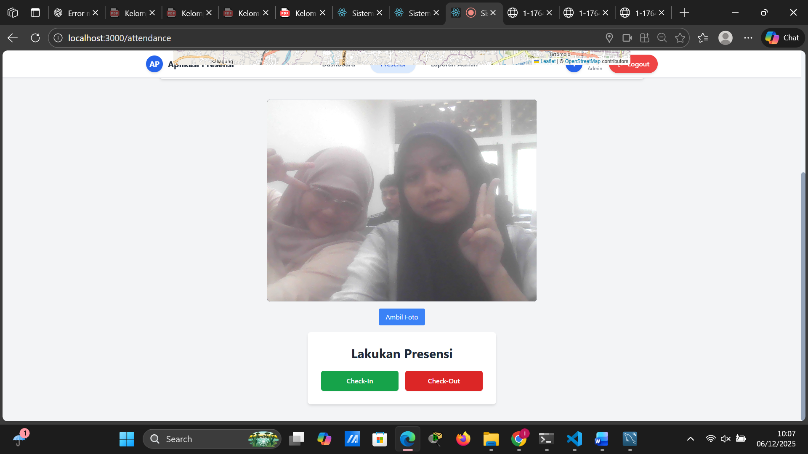
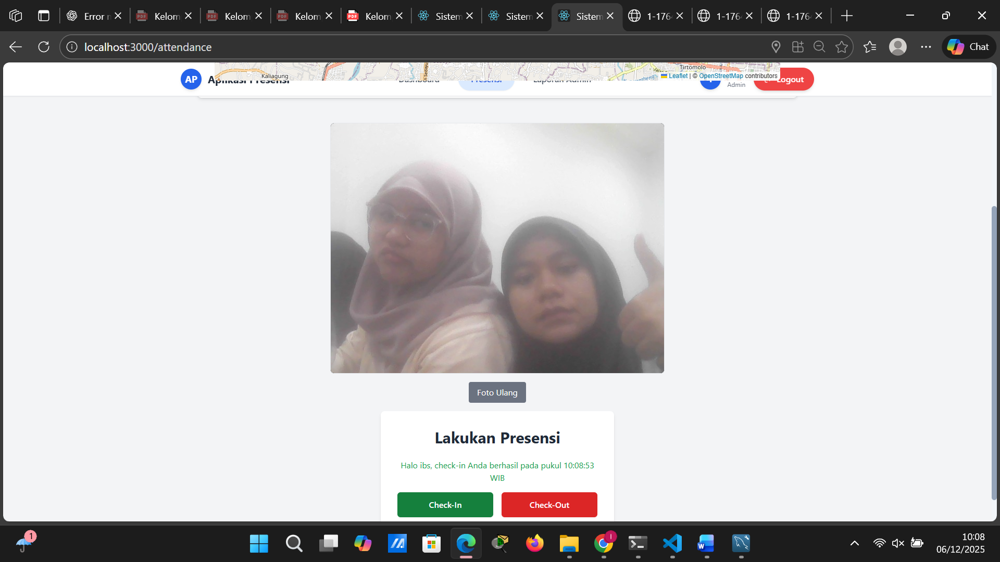
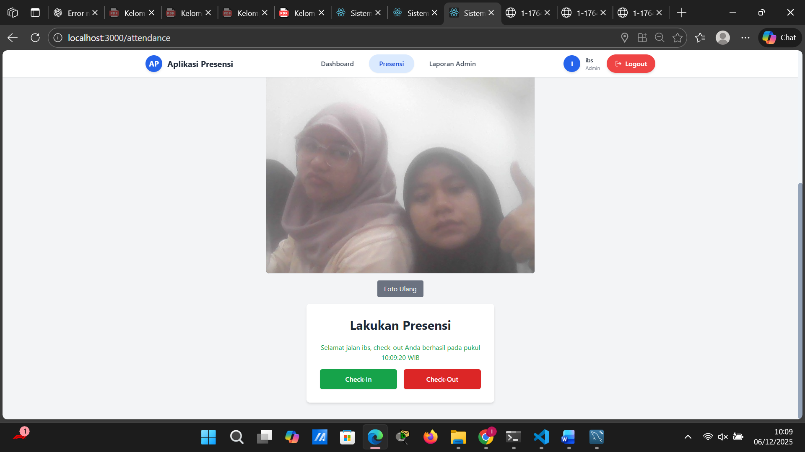
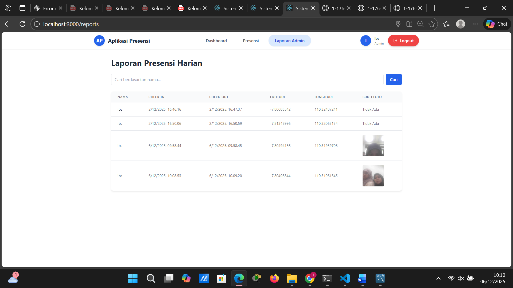
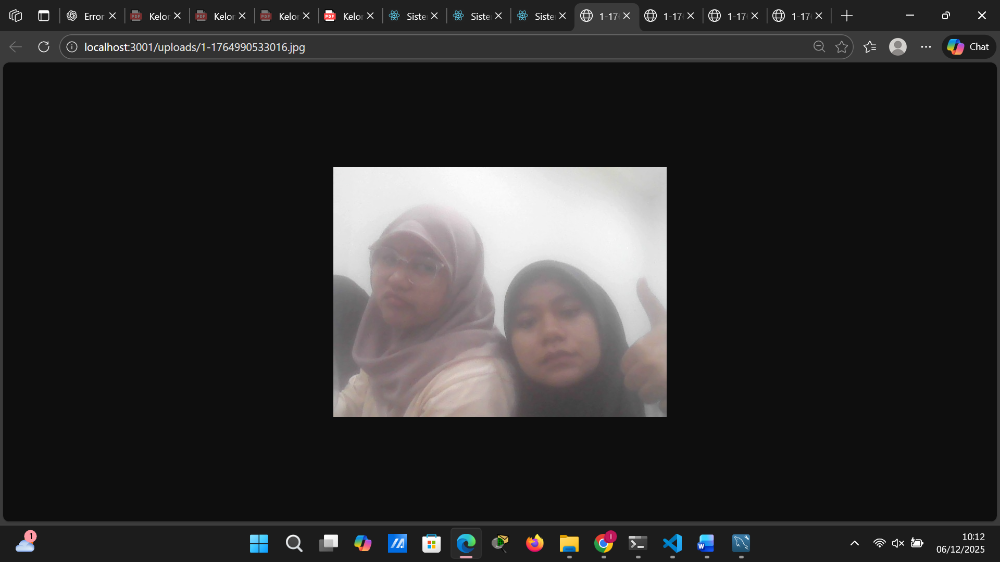
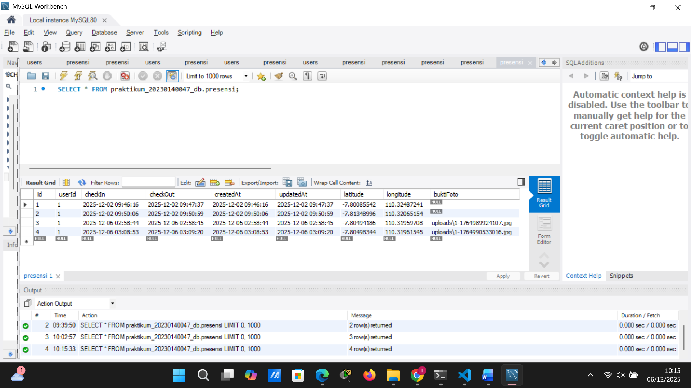

# Tugas 10

1. Tampilan Endpoint PresensiPage yg menampilkan kamera

2. Tampilan Endpoint PresensiPage yg menampilkan kamera saat check in

3. Tampilan PresensiPage yg menampilkan kamera saat check out

4. Tampilan Endpoint "Bukti Foto" di tabel reportpage.

5. Tampilan Endpoint Tampilan thumbnail foto yang diambil dari URL

6. Tampilan Endpoint Database

