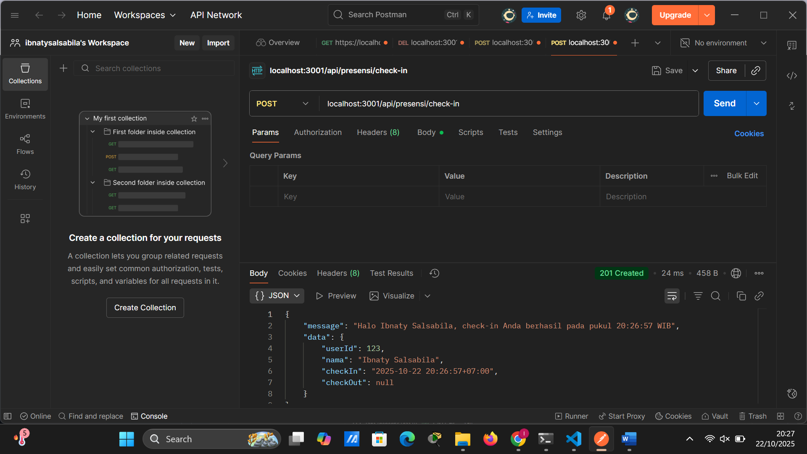
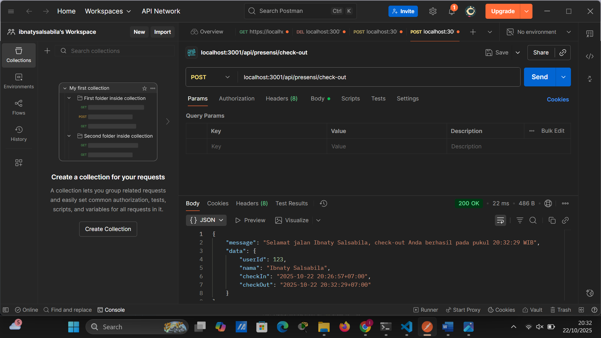
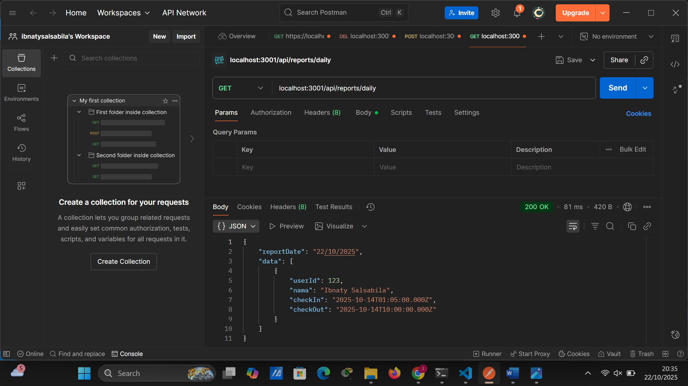

# Tugas 3

1. Tampilan Endpoint Presensi Check-in (POST)

2. Tampilan Endpoint Presensi Check-in lebih dari sekali (POST)
.png)

3. Tampilan Endpoint  Presensi Check-out (POST)

4. Tampilan Endpoint  Presensi Check-out belum melakukan check-in (POST)
.png)

5. Tampilan Endpoint reportsdaily (GET)
