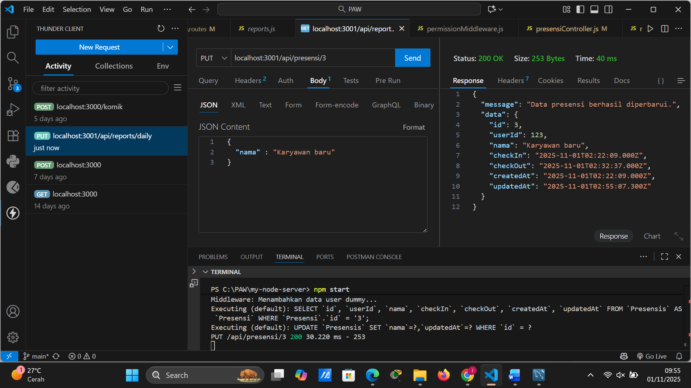
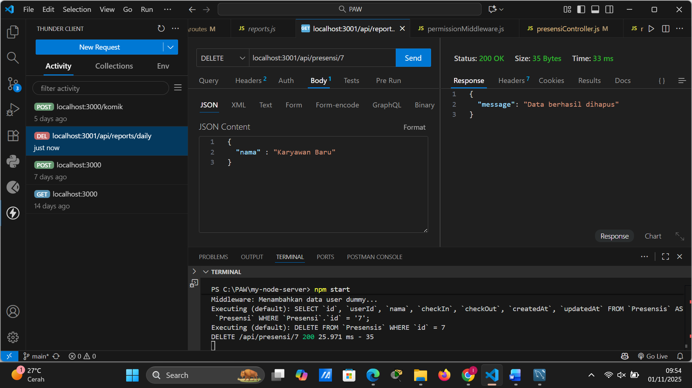
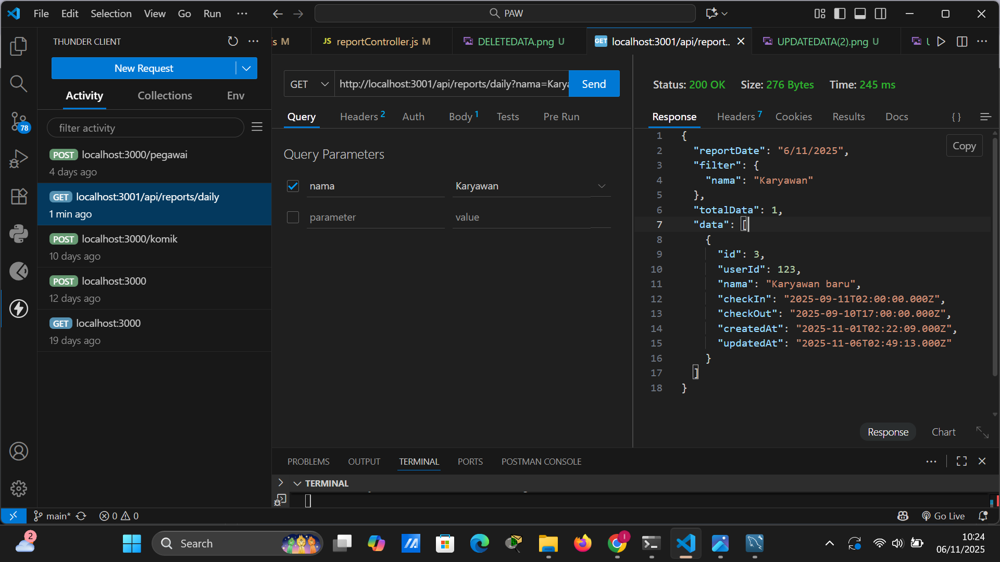

# Tugas 5

1. Tampilan Endpoint update data presensi.

2. Tampilan Endpoint update jika format tanggal yang diisi tidak valid
.png)

3. Tampilan Endpoint delete data

4. Tampilan Endpoint search berdasarkan nama

5. Tampilan Endpoint search berdasarkan tanggal
.png)
