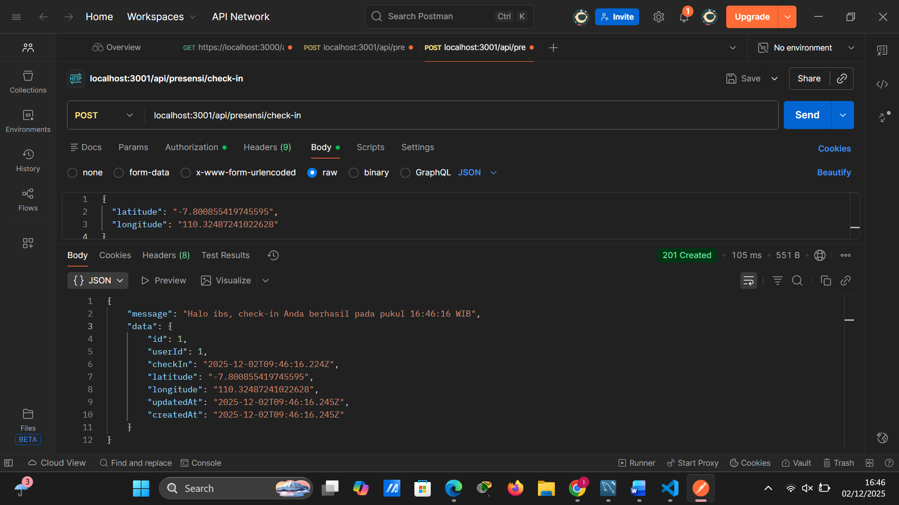
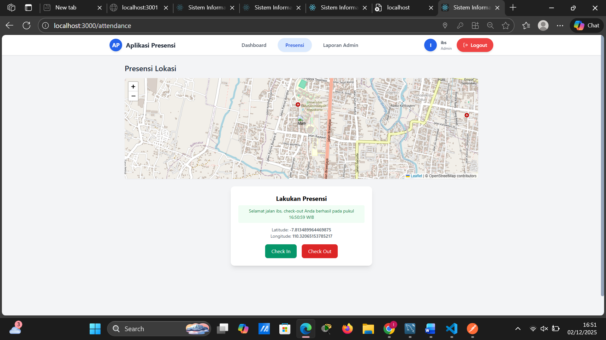
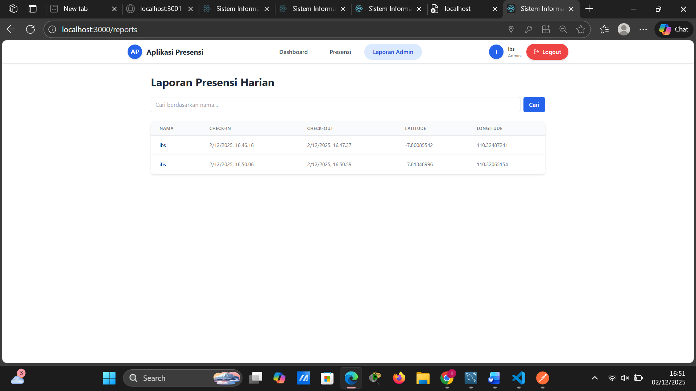
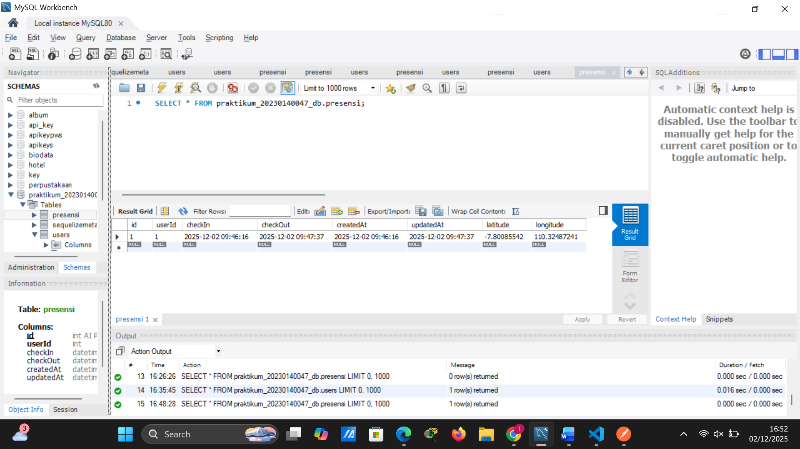

# Tugas 9

1. Tampilan Endpoint presensi/check-in dengan menggunakan bearer token dan body latitude, longitude

2. Tampilan Endpoint Check-in dengan menampilkan maps OSM
.png)

3. Tampilan Endpoint Check-out dengan menampilkan maps OSM

4. Tampilan Endpoint Report Admin

5. Tampilan Endpoint Database Presensi

